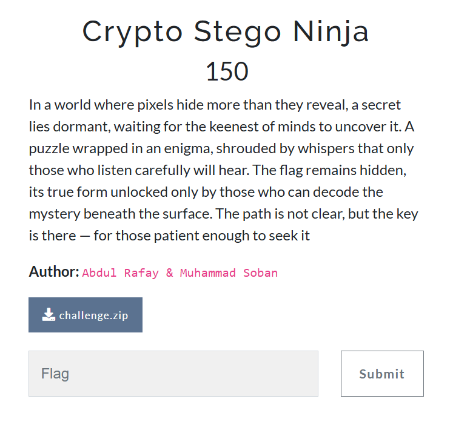
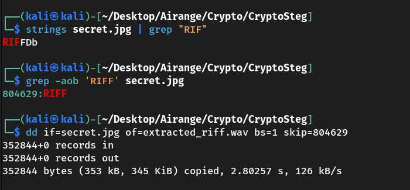
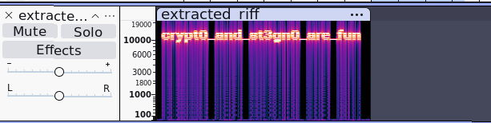
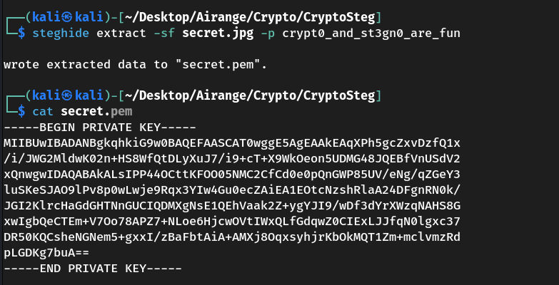
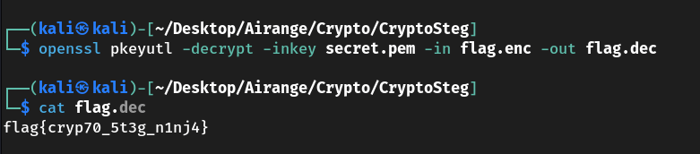

# 🥷 Crypto Stego Ninja — Challenge Writeup

## 🔍 Challenge Overview



You are provided with two files:

- `secret.jpg`
- `flag.enc`

---

## 🧪 Step 1: Reconnaissance & Clues

- Running `strings` on `secret.jpg` showed an embedded `RIFF` header:
````
  strings secret.jpg | grep "RIFF"
````

* Using byte-level grep to locate the offset:

  ```
  grep -aob 'RIFF' secret.jpg
  ```


* Extracted embedded WAV audio using `dd`:

  ```
  dd if=secret.jpg of=extracted_riff.wav bs=1 skip=804629
  ```



* Spectrogram analysis of `extracted_riff.wav` using Audacity revealed the hidden passphrase:

  ```
  crypt0_and_st3gn0_are_fun
  ```



---

## 🖼️ Step 2: Steganography Extraction

Used `steghide` to extract hidden data from the image:

```
steghide extract -sf secret.jpg -p crypt0_and_st3gn0_are_fun
```

➡️ Extracted file: `secret.pem` (identified as an RSA **private key**)



---

## 🔐 Step 3: Decrypt the Flag

Used the private RSA key to decrypt `flag.enc`:

```
openssl pkeyutl -decrypt -inkey secret.pem -in flag.enc -out flag.dec
```


📜 Decrypted Flag:

```
flag{cryp70_5t3g_n1nj4}
```

## 🏁 Final Flag

```
flag{cryp70_5t3g_n1nj4}
```

---

## 👤 Author

### ~ **Basim Mehdi**  
### ~ *Team: 0xFAILURES*