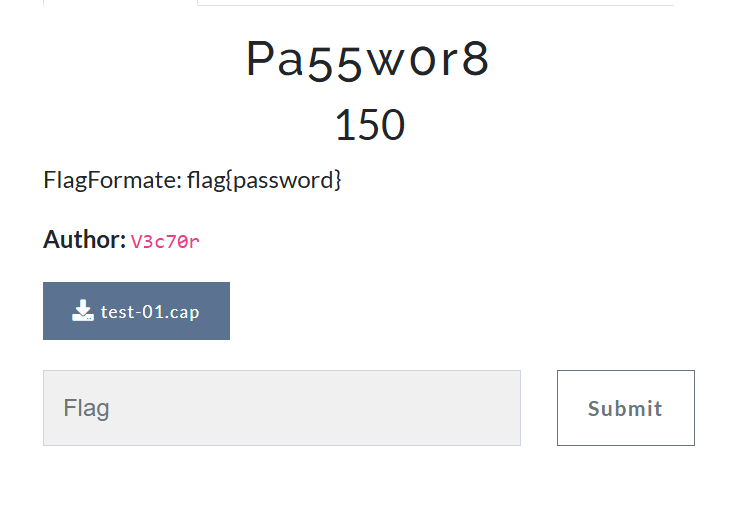
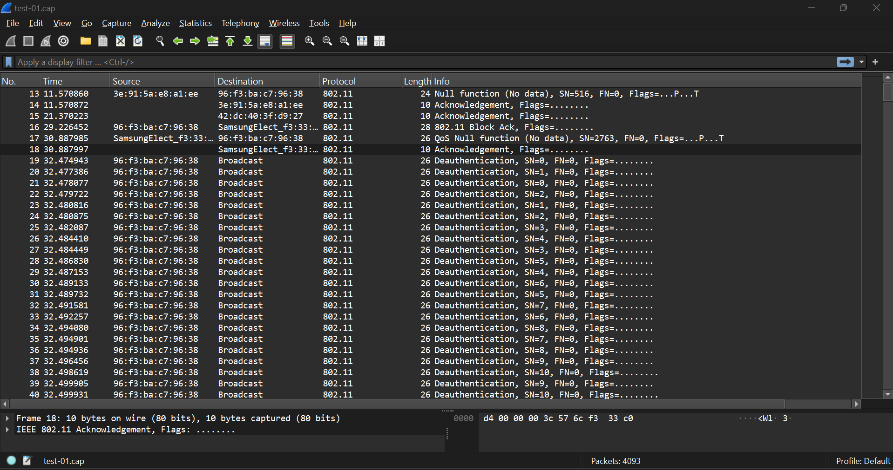
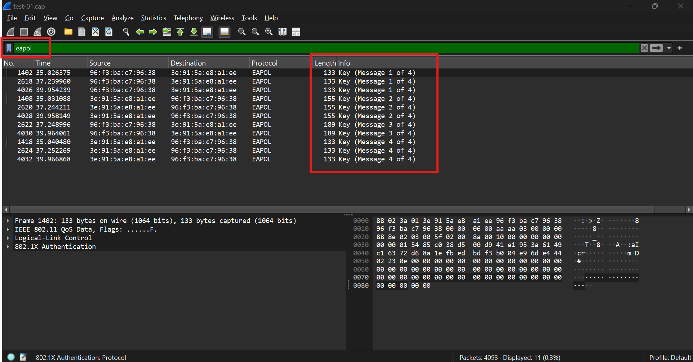
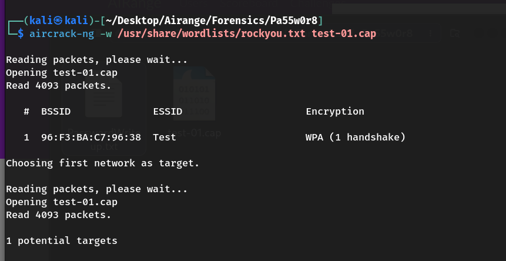
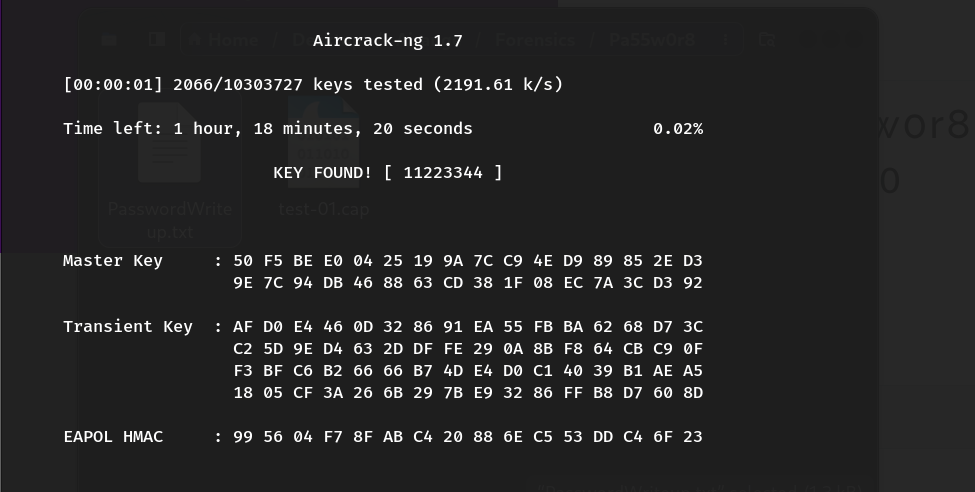

# Challenge: Pa55w0r8

## Wi-Fi Password Extraction from .pcap File (WPA Handshake Cracking)

### Challenge Summary

You are provided with a `.cap` file containing 802.11 Wi-Fi packets, including a captured WPA handshake. The objective is to extract the handshake and recover the Wi-Fi password, which serves as the flag.


---

### Step 1: Initial Analysis

The file `cap1.pcap` was analyzed and found to contain over 4000 Wi-Fi packets. Deauthentication frames and a complete WPA handshake were identified.



---

### Step 2: Crack the WPA Handshake Password

With the handshake captured, a dictionary attack can be used to recover the password. The `rockyou.txt` wordlist is commonly used for this:

```
aircrack-ng -w /usr/share/wordlists/rockyou.txt test-01.cap
````

This command tests each password in the wordlist against the WPA handshake found in the capture.



---

### Step 3: Retrieve the Password

After running the cracking command, the key was successfully recovered:

```
KEY FOUND! [ 11223344 ]
```



---

### Final Flag

Given the required flag format `flag{password}`, the final flag is:

```
flag{11223344}
```
---

## 👤 Author

### **Basim Mehdi**  
#### *Team: 0xFAILURES*