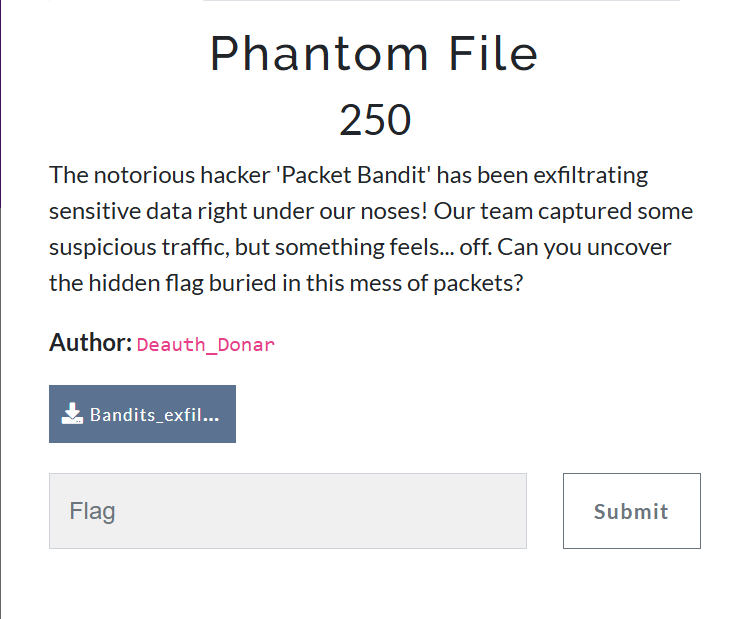
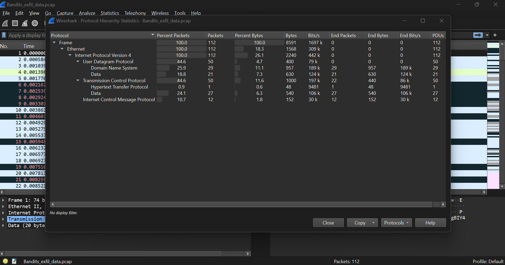
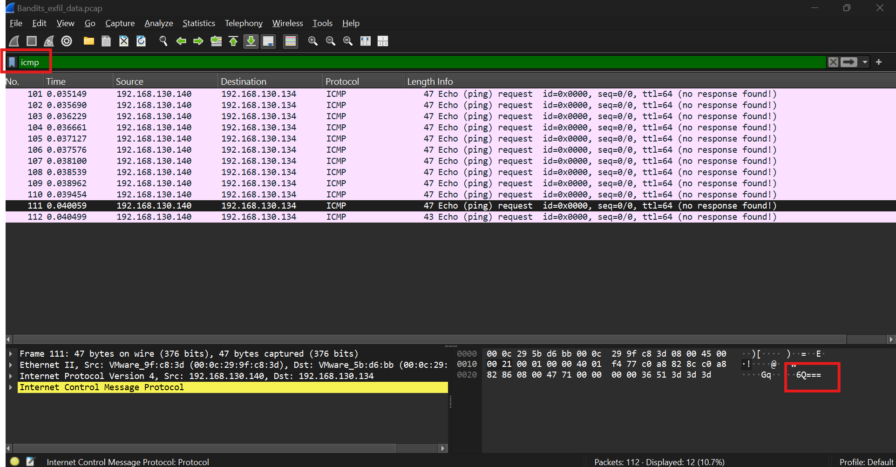
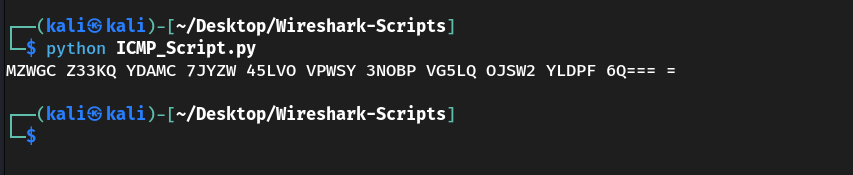
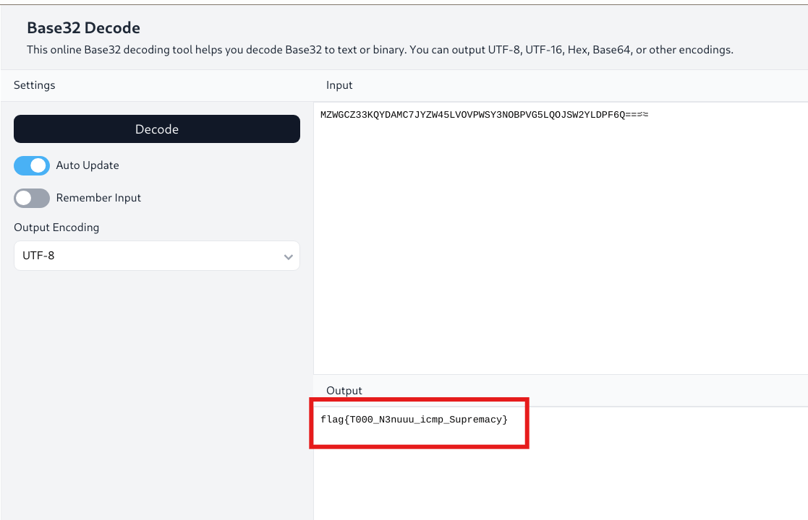

# Challenge: Phantom File

## Extracting Hidden Data from ICMP Packets

### Challenge Summary



---

## Step 1: Analyzing the Capture File

Upon inspection of `capture.pcap`, it was observed that several ICMP packets contained payloads. These payloads appeared to be encoded text fragments — likely Base32.




---

## Step 2: Extract Base32 Text from ICMP Packets

To automate the extraction of these payloads, the following Python script was used. It leverages Scapy to parse the `.pcap` file and extract readable data from ICMP packet payloads.

### 📜 ICMP_Script.py

```python
from scapy.all import rdpcap, ICMP

def extract_text(packet):
    if packet.haslayer(ICMP) and hasattr(packet, 'load'):
        try:
            return packet.load.decode(errors="ignore")
        except:
            return ""
    return ""

# Load packets from the pcapng file
pcap_file = "capture.pcap"  # Change this to your file path
packets = rdpcap(pcap_file)

# Extract text from all ICMP packets and print in a single-line format
texts = [extract_text(pkt) for pkt in packets if extract_text(pkt)]
print(" ".join(texts))  # Output as a single-line string
````



---

## Step 3: Decode Base32 Payload

Running the script produced this output:

```
MZWGC Z33KQ YDAMC 7JYZW 45LVO VPWSY 3NOBP VG5LQ OJSW2 YLDPF 6Q=== =
```

After removing extra spaces and padding, the cleaned Base32 string was:

```
MZWGCZ33KQYDAMC7JYZW45LVOVPWSY3NOBPVG5LQOJSW2YLDPF6Q====
```

This was decoded using a Base32 decoder online. The result revealed the flag.



---

## Final Flag

```
flag{T000_N3nuuu_icmp_Supremacy}
```

---

## Author

### **Basim Mehdi**

### *Team: 0xFAILURES*


