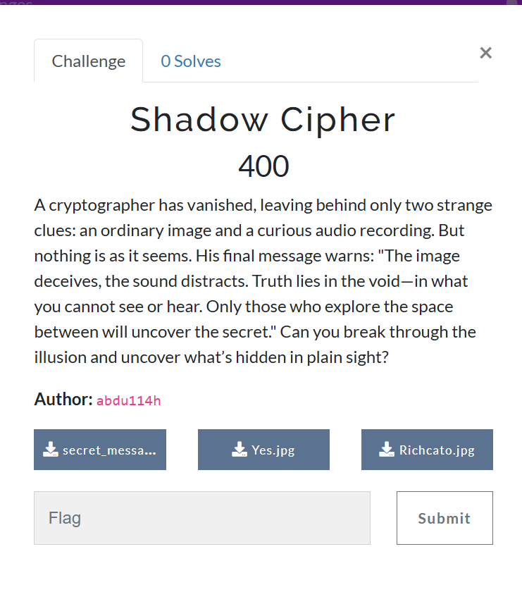
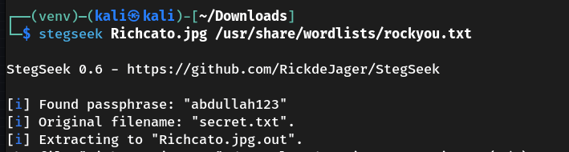
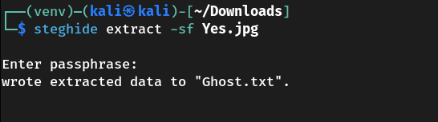
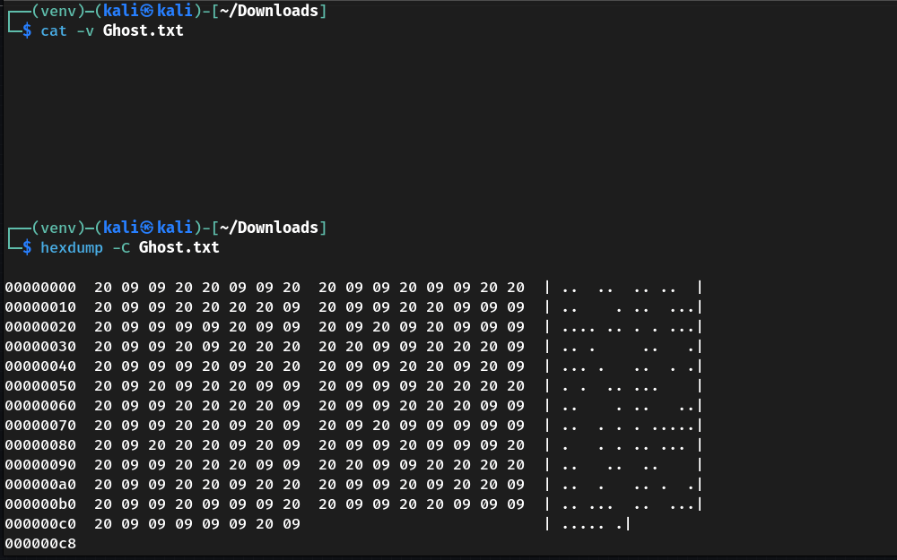
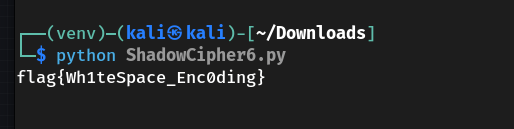

# 🕵️ CTF Challenge Writeup: Shadow Cipher

## 📖 Challenge Overview



---

## 🔍 Step 1: Initial Stego Extraction with StegSeek

We used `stegseek` with the popular `rockyou.txt` wordlist:

```
stegseek Richato.jpg /usr/share/wordlists/rockyou.txt
```



### Result:

* ✅ **File 1**: Contained suspicious hex data — likely a **decoy**
* ✅ **File 2**: Contained a hex string that converted to an ASCII password


## 🔓 Step 2: Unlocking the Second Stego File (`stegno`)

Used the recovered password to extract content from the second stego image:

```
steghide extract -sf Yes.jpg -p 098890123321
```

➡️ This revealed a new file: `Ghost.txt`



---

## 👻 Step 3: Inspecting `Ghost.txt`

At first glance, the file appeared empty:

```
cat Ghost.txt
```

To probe deeper, we examined the hexadecimal contents:

```
hexdump -C Ghost.txt
```

### Detected Byte Values:

* `0x20` → Space
* `0x09` → Tab



---

## 🧠 Step 4: Decoding the Whitespace Steganography

We created a Python script to convert the whitespace characters to binary:

* `Space (0x20)` → `0`
* `Tab (0x09)` → `1`

### `decode_whitespace.py`

```
def decode_whitespace(file_path):
    with open(file_path, "rb") as f:
        data = f.read()

    bits = ""
    for byte in data:
        if byte == 0x20:
            bits += "0"
        elif byte == 0x09:
            bits += "1"

    chars = []
    for i in range(0, len(bits), 8):
        byte = bits[i:i+8]
        if len(byte) < 8:
            break
        chars.append(chr(int(byte, 2)))

    decoded_message = "".join(chars)
    return decoded_message

if __name__ == "__main__":
    decoded = decode_whitespace("Ghost.txt")
    print("Decoded Message:")
    print(decoded)
```

### Running the script:

python3 ShadowCipher6.py




---

## 🏁 Final Result

The Python script successfully decoded the flag hidden via **whitespace steganography**.

---

## 🧰 Tools Used

* `stegseek`
* `steghide`
* `xxd`, `hexdump`
* Python 3


