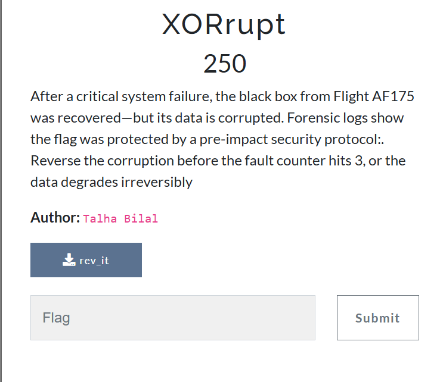
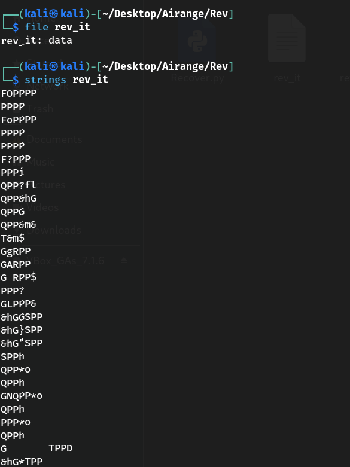
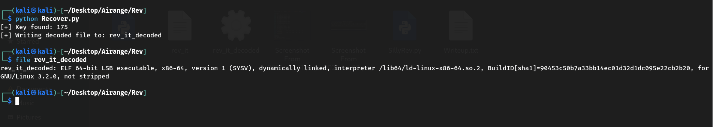
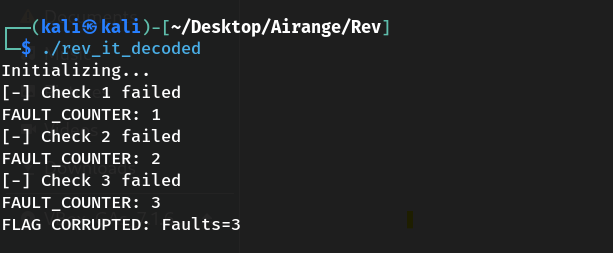
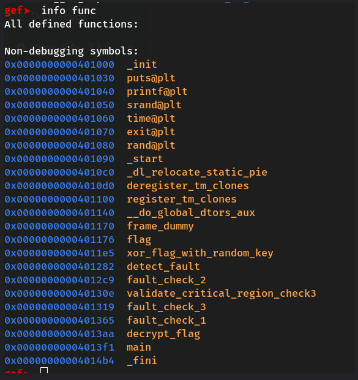
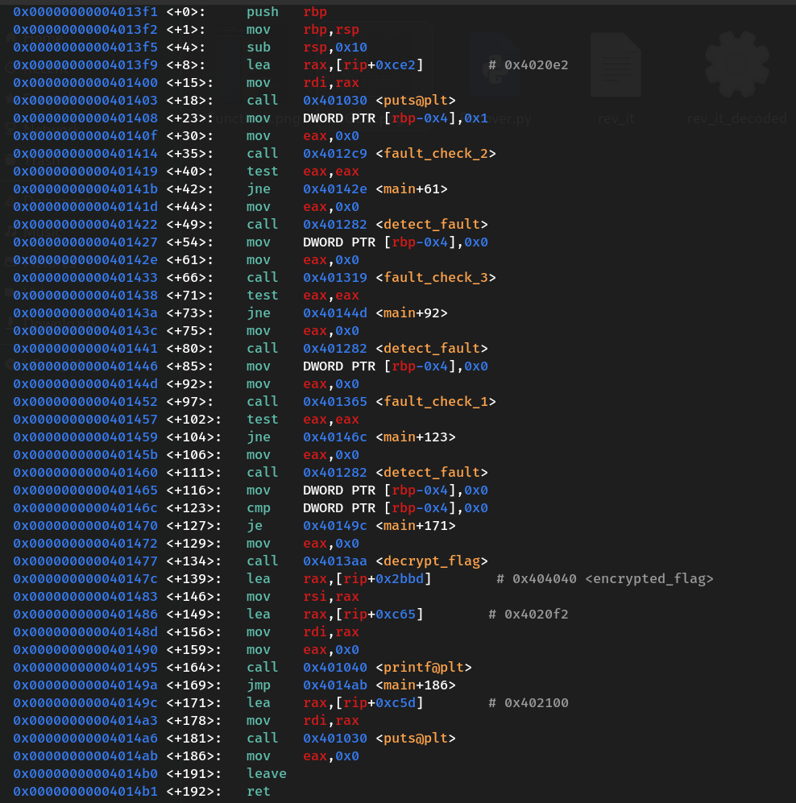
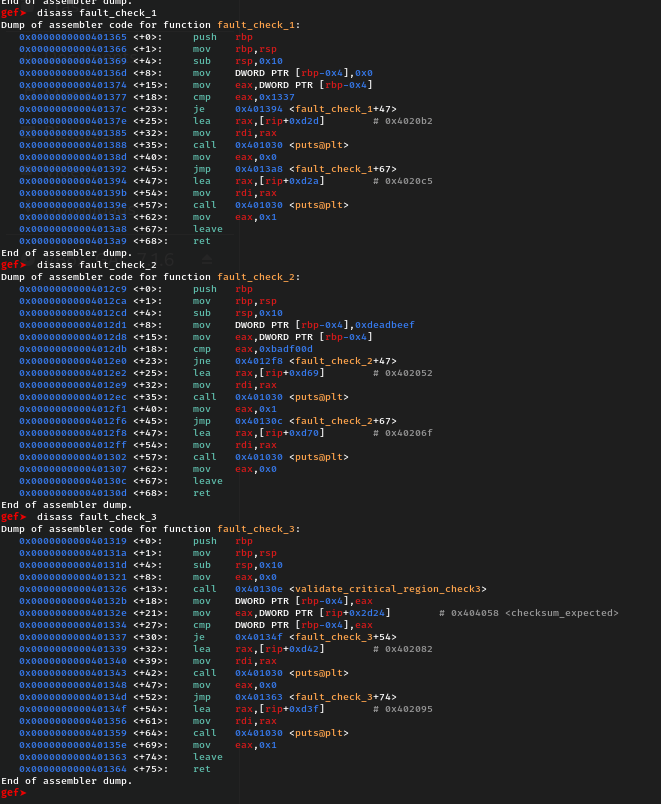
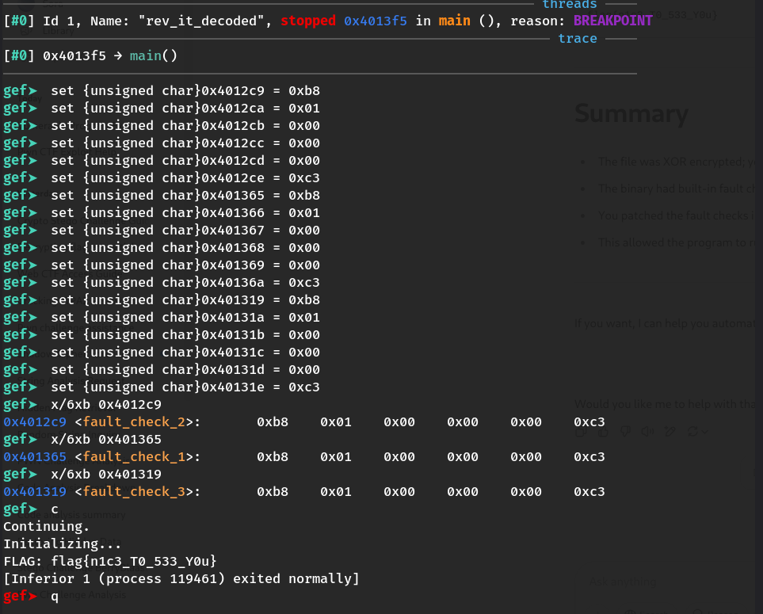

# 🔍 XoRrupt — Reverse Engineering Writeup

## 🧠 Challenge Summary



You're given a suspicious binary named `rev_it` that appeared corrupted or non-executable. The objective was to analyze, recover, and reverse engineer it to retrieve the hidden flag.

---

## 📸 1. Initial Inspection – Corrupt File Format

* The file couldn’t be executed or identified as a valid ELF binary.
* Seemed it was XOR-encoded or packed.



---

## 🔓 2. Recovering the Binary — XOR Brute Force Script

A Python script was used to brute-force all 256 XOR keys. When the correct key was found (flag appeared in plaintext), the script dumped the clean binary.

````
input_file = "rev_it (1)"
output_file = "rev_it_decoded"

with open(input_file, "rb") as f:
    data = f.read()

for key in range(256):
    decoded = bytes([b ^ key for b in data])
    if b"flag{" in decoded or b"ctf{" in decoded:
        print(f"[+] Key found: {key}")
        print("[+] Writing decoded file to:", output_file)

        with open(output_file, "wb") as out:
            out.write(decoded)
        break
````

✅ A valid ELF binary was recovered and saved as `rev_it_decoded`.



---

## 🚀 3. Executing the Recovered File

Attempting to run `rev_it_decoded` displayed a **"FLAG CORRUPTED"** message and exited. It was clear some runtime checks were interfering.



---

## 🧬 4. Static Analysis — Function Discovery via GDB

We loaded the binary into `gdb` with `gef` and discovered key functions using:

```
info functions
```

Among the listed functions were:

* `fault_check_1`
* `fault_check_2`
* `fault_check_3`
* `main`



---

## 🧠 5. Disassembling Main and Fault Checks

Disassembly of `main` showed the three `fault_check_X()` functions being called before the flag was printed.

```
call fault_check_1
call fault_check_2
call fault_check_3
```

Each of these functions validated certain conditions. Failing even one printed a "FLAG CORRUPTED" message and exited.





---

## 🩹 6. Patching Fault Checks in GDB

To bypass the protections, each `fault_check_X` function was patched in GDB to simply return success (`eax = 1; ret`):

```
set {unsigned char}0x4012c9 = 0xb8  # mov eax, imm32
set {unsigned char}0x4012ca = 0x01
set {unsigned char}0x4012cb = 0x00
set {unsigned char}0x4012cc = 0x00
set {unsigned char}0x4012cd = 0x00
set {unsigned char}0x4012ce = 0xc3  # ret
```

This was repeated for all three `fault_check` functions.



---

## 🏁 7. Final Execution — Revealing the Flag

With all protections disabled, we continued the program’s execution and it printed the flag:

```
flag{n1c3_T0_533_Y0u}
```

---

## 👤 Author

### ~ **Basim Mehdi**  
### ~ *Team: 0xFAILURES*
