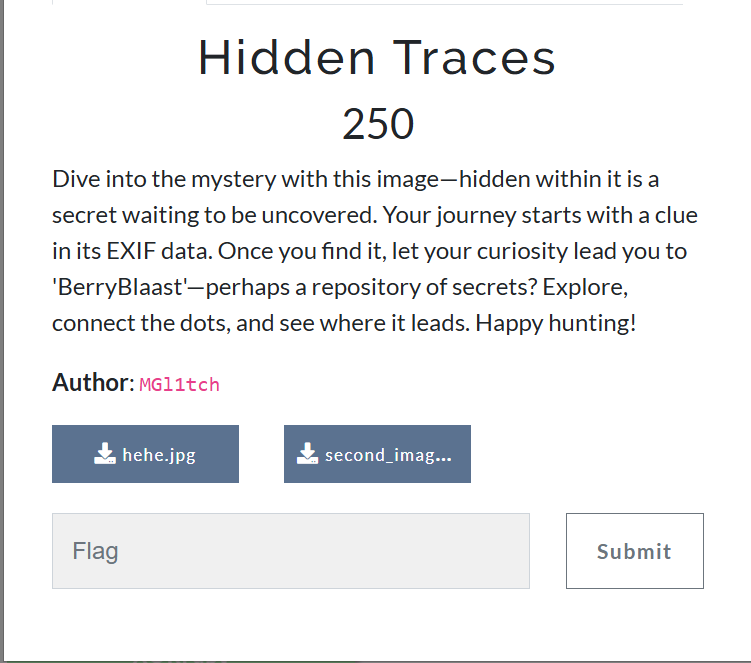

## 🕵️‍♀️ CTF Challenge Writeup: **Hidden Traces**



---

### 📝 Challenge Description

> *Dive into the mystery with this image—hidden within it is a secret waiting to be uncovered. Your journey starts with a clue in its EXIF data. Once you find it, let your curiosity lead you to 'BerryBlaast'—perhaps a repository of secrets? Explore, connect the dots, and see where it leads. Happy hunting!*

From this, two key clues stood out:

* **Start with EXIF data** of the image.
* **BerryBlaast** + “repository” hints at a **GitHub account** 

---

### 🔍 Step 1: Analyzing `hehe.jpg`

Using `exiftool` or an online EXIF viewer, the **comment** field revealed the following:


```
qrw d fubswr fkdoohqjh khkh
```


This looked like a Caesar cipher. Decoding it using ROT-3 gave:

```
not a crypto challenge hehe
```


🔎 Interpretation: This is not a crypto challenge — **look elsewhere**, possibly **steganography**.

---

### 🔗 Step 2: Following the “Repository” Clue

The challenge said:

> *"...let your curiosity lead you to 'BerryBlaast'—perhaps a repository of secrets?"*

Searching **GitHub** for `BerryBlaast` led us to:
🔗 [https://github.com/BerryBlaast](https://github.com/BerryBlaast)


Here, we found a relevant repo:
📁 **Simple-Stegnography-Tool-in-C-**

It contained a C++ tool to **hide/reveal messages inside `.bmp` images** using a **key**.


---

### 🛠 Step 3: Building the Tool

We cloned and compiled the C++ steganography tool:

```
git clone https://github.com/BerryBlaast/Simple-Stegnography-Tool-in-C-
cd Simple-Stegnography-Tool-in-C-/code
g++ "StegnoGraphy tool.cpp"
```


This gave us a binary , which supports decoding messages from `.bmp` files when supplied with the correct **decryption key**.

---

### 🖼 Step 4: Target Image: `second_image.bmp`

The challenge provided a second image: `second_image.bmp`.

We suspected this contained a hidden message, likely the flag because tool is related to BMP files Stegno.

But what was the **decryption key**?

We recalled the passphrase from the **first image**:
“not a crypto challenge hehe”

Using this as the passphrase or decryption key with the tool, we extracted the flag.


---

### 🎉 Flag

```
flag{Fr4m3d_1n_S1l3nc3}
```

---

## 👤 Author

### ~ **Basim Mehdi**  
### ~ *Team: 0xFAILURES*