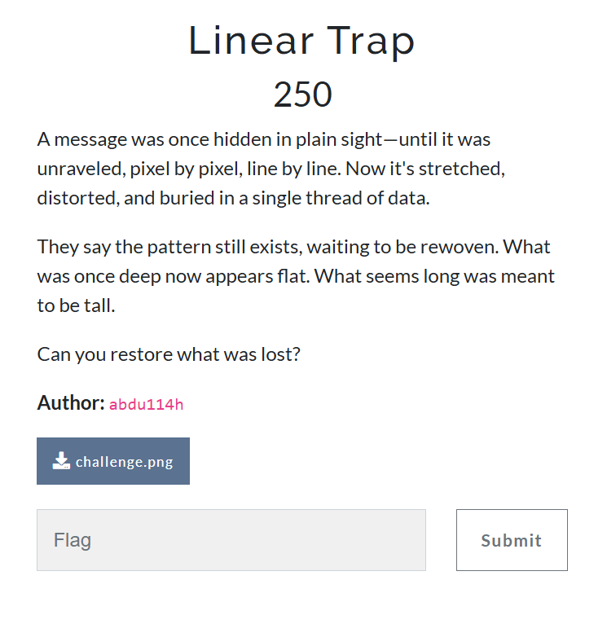
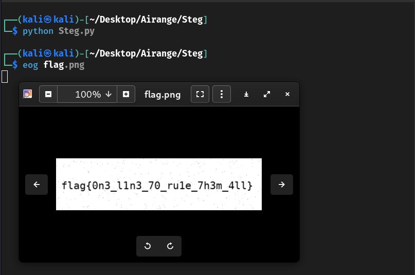

Here's a well-structured `README.md` for your **"Threaded Vision"** challenge writeup, ready for use in a CTF repository, blog, or portfolio:
# Linear Trap – Challenge Writeup

## 📁 Challenge File

- `challenge.png`

---

## 🧠 Challenge 



---

## 🔍 Initial Analysis

Opening `challenge.png` in an image viewer revealed a distorted or stretched-out picture, with no obvious flag or content visible.

Clues from the prompt suggested:

- The image had been **flattened** or **restructured** improperly.
- Phrases like *"pixel by pixel, line by line"* and *"what seems long was meant to be tall"* hinted that the image data had likely been reshaped incorrectly in one dimension.

This pointed toward a **reshaping-based steganography** technique—where an image array is misaligned by modifying width and height.

---

## 🛠️ Solving the Puzzle

We turned to Python, using the **Pillow (PIL)** and **NumPy** libraries to analyze and manipulate the image data.

### 🔧 Step-by-Step:

```python
from PIL import Image
import numpy as np

# Load the image
img = Image.open("challenge.png")
pixels = np.array(img)

# Inspect the current shape of the image data
print(pixels.shape)
````

I thought the data was just in a straight line, but it was actually meant to be shown in a different shape. After trying a few sizes, I found that reshaping it into 100 rows and 400 columns made it look correct again.

```
reshaped = pixels.reshape((100, 400, 3))  # Assuming 3 color channels (RGB)
Image.fromarray(reshaped).save("flag.png")
```

---

## 🏁 Result



After reshaping, the saved image `flag.png` revealed a cleanly embedded flag that had been obscured in the distorted original image.

---

## ✅ Flag

```
flag{0n3_l1n3_70_rule_7h3m_4ll}
```
---

## 👤 Author

### ~ **Basim Mehdi**  
### ~ *Team: 0xFAILURES*